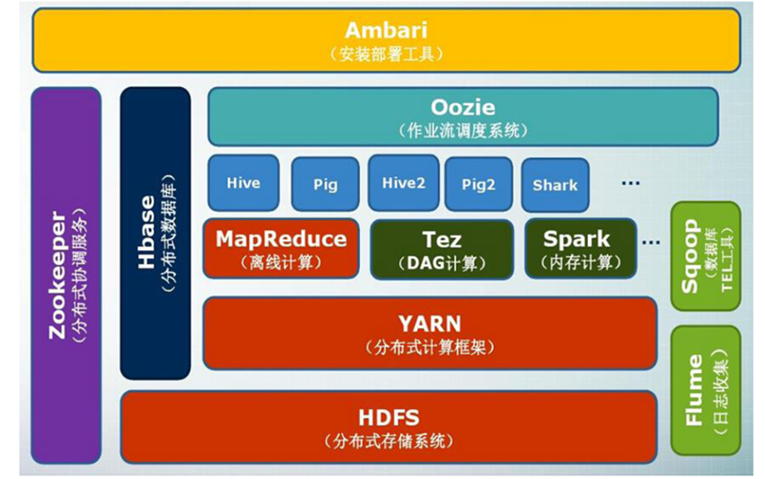

# 大数据概述

## 大数据概念

1. 数据量大
2. 数据类型多
3. 处理速度快
4. 数据价值密度低

## 大数据的关键技术

1. 非新生技术：
   1. 数据库
   2. 数据仓库技术
   3. 联机分析处理
   4. 数据挖掘
   5. 数据隐私和安全
   6. 数据可视化
2. 新生技术：
   1. 分布式并行编程
   2. 分布式文件系统
   3. 分布式数据库
   4. NoSQL 数据库
   5. 云数据库
   6. 流计算和图计算

# 大数据处理架构 Hadoop

## Hadoop 概述

Hadoop的核心组件：

1. HDFS(Hadoop Distributed File System)：面向普通硬件环境的分布式文件系统，读写速度搞，容错性和可伸缩性强，支持大规模数据的分布式存储， 通过冗余数据存储的方式保证数据安全性（相当于备份）
2. MapReduce：允许用户在不了解分布式系统底层细节的情况下开发**并行**应用程序，使用其整合分布式文件系统上的数据，可保证分析和处理数据的高效性。

Hadoop 的特性：

- 高可靠性
- 高效性
- 高可拓展性
- 高容错性
- 成本低
- 运行在Linux平台
- 支持多种编程语言

## Hadoop 的项目架构

> 本笔记非原创内容，笔记来源：https://datawhalechina.github.io/juicy-bigdata/#/ch2%20Hadoop