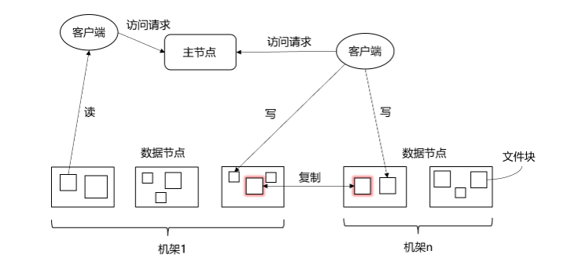

# HDFS

## 块的概念：

普通文件系统 v.s. 分布式文件系统

- **普通文件系统**： 一般将磁盘空间划分为512字节一组，称为磁盘块。这是文件系统读写的最小单元。文件系统的块（Block）通常是磁盘块的整数倍。
- **分布式文件系统**：虽然也是用块，但是相较于普通文件系统，分布式文件系统的块要比普通文件系统中的块大很多。HDFS默认一个块的大小是64MB。

## HDFS的结构：

分布式文件系统的设计一般采用**“客户机/服务器(Client/Server)”**的结构，客户端通过网络与服务器建立连接。服务器在物理结构上由计算机集群的多个节点构成，这些节点分为两类：

1. 主节点(Master Node)/名称节点(NameNode)：负责管理文件目录
2. 从节点(Worker Node)/数据节点(DataNode)：负责存储具体的数据

## HDFS的局限性：

1. **不适合低延迟数据的访问**：HDFS主要是面向大规模数据批处理而设计的，采用流式数据读取，具有很高的数据吞吐率，但是带来了较高的延迟。对于低延迟要求的应用程序而言，**HBase是一个更好的选择**。
2. **无法高效存储大量小文件**
   1. 大量小数据会导致名称节点管理文件系统的元数据过大，而这些元数据需要储存在内存中。
   2. 使用MapReduce处理大量小文件时，会产生过多的Map任务，线程管理开销大大增加。
   3. 访问大量小文件需要在不同文件中逐个跳转，严重影响性能。
3. **不支持多用户写入及任意修改文件**。

## 冗余（多副本）储存的优势：

1. 加快数据传输速度：就近使用副本。
2. 容易检查数据错误：相互比对。
3. 保证数据的可靠性：有备份。

## 数据存取策略：

数据存取策略包括**数据存放、数据读取和数据复制**。HDFS的数据复制采用**流水线复制**的策略，大大提高了数据复制过程的效率。

